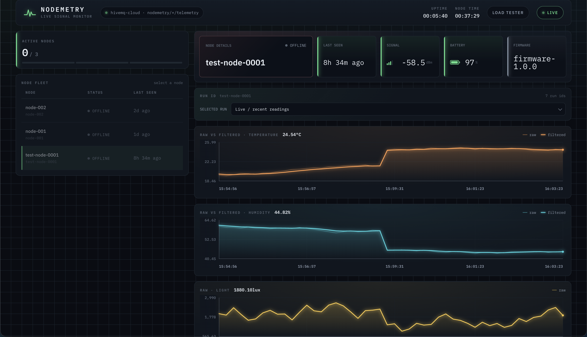
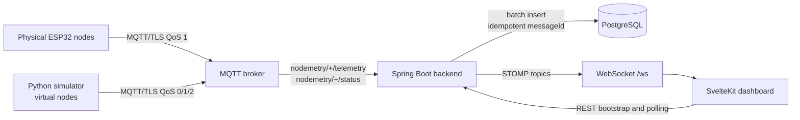

# Nodemetry

Nodemetry is an MQTT-based IoT telemetry platform for physical ESP32 sensor
nodes and virtual load-test nodes. The Spring Boot backend ingests telemetry
over MQTT/TLS, validates message identifiers, handles QoS 1 redelivery
idempotently with unique `messageId` values, persists readings in PostgreSQL,
tracks node health and run-level ingestion metrics, and broadcasts live updates
over WebSocket/STOMP to a SvelteKit dashboard.

The project is designed to demonstrate production-oriented backend ingestion,
real-time UI updates, load-test tooling, and practical bottleneck analysis for
IoT telemetry systems.

## Links

| Resource    | URL                              |
| ----------- | -------------------------------- |
| Live demo   | `https://nodemetry.vercel.app`   |
| Backend API | `TODO: add deployed backend URL` |

## Verified Benchmark Summary

The current implementation has been exercised with virtual MQTT nodes using the
bundled Python simulator:

| Scenario                             | Result                                                             |
| ------------------------------------ | ------------------------------------------------------------------ |
| 100 virtual nodes, 5 second interval | Approximately 19.5 messages/second, stable                         |
| 250 virtual nodes, 5 second interval | Approximately 49 messages/second, stable                           |
| Repeated 250-node runs               | Over 99.6% persistence of unique received telemetry                |
| 300 virtual nodes                    | MQTT receipt remained high, but PostgreSQL persistence fell behind |
| Duplicate-delivery test              | Repeated `messageId` values were rejected idempotently             |

Metric definitions used in this project:

- Expected: configured number of expected messages.
- Received: messages accepted by the backend.
- Duplicates: repeated `messageId` values rejected.
- Unique received: `received - duplicates`.
- Saved: unique messages persisted successfully.
- Delivery percentage: `received / expected`.
- Persistence percentage: `saved / unique received`.

Queued simulator messages are not counted as delivered or persisted.

## Screenshots

Replace these placeholders with captured production screenshots:

| View                         | Placeholder                                              |
| ---------------------------- | -------------------------------------------------------- |
| Live physical-node dashboard |  |
| Node detail and charts       | `docs/screenshots/node-detail.png`                       |
| Load-test run results        | `docs/screenshots/load-test-results.png`                 |
| Ingestion metrics panel      | `docs/screenshots/ingestion-metrics.png`                 |

## Documentation

- [Backend README](backend/README.md)
- [Frontend README](frontend/README.md)
- [Simulator README](simulator/README.md)

## Architecture



## Data Flow

1. A physical ESP32 node or virtual simulator node publishes telemetry to
   `nodemetry/{nodeId}/telemetry`.
2. Nodes also publish retained status messages to `nodemetry/{nodeId}/status`;
   the simulator sets Last Will messages for unclean disconnect detection.
3. The backend MQTT subscriber receives messages from the broker and forwards
   telemetry into an in-memory batch queue.
4. The batch ingest service validates required fields and safe identifier
   formats before database work begins.
5. Unique readings are inserted into `sensor_readings`; duplicate `messageId`
   values are counted and rejected.
6. Node health is updated in `nodes`.
7. Virtual load-test runs are tracked as aggregate runs, while physical nodes are
   tracked per `(runId, nodeId)` in `physical_node_runs`.
8. Stored readings and node-status changes are broadcast over STOMP topics.
9. The dashboard bootstraps current state over REST, then keeps itself current
   through WebSocket updates and metric polling.

## Main Engineering Features

- MQTT/TLS telemetry ingestion with QoS 1 duplicate tolerance.
- Idempotent persistence using globally unique `messageId` values.
- Batched database writes with queue capacity and batch-size tuning.
- PostgreSQL-backed node, reading, virtual-run, and physical-run state.
- Per-node physical-run metrics and aggregate virtual load-test metrics.
- STOMP over WebSocket for live readings, node status, and latest-node updates.
- SvelteKit dashboard with physical-node charts and read-only production
  load-test views.
- Python simulator with dedicated connection mode, shared connection mode,
  duplicate-rate testing, and QoS comparison support.
- Production HTTP API read-only mode by default.

## Tech Stack

| Layer      | Technology                                                              |
| ---------- | ----------------------------------------------------------------------- |
| Backend    | Java 21, Spring Boot 4.1, Spring MVC, Spring Data JPA, Spring WebSocket |
| Database   | PostgreSQL in production, H2 for tests                                  |
| Messaging  | MQTT/TLS, paho-mqtt for simulator, Eclipse Paho client for backend      |
| Frontend   | SvelteKit 2, Svelte 5, Vite, STOMP over WebSocket                       |
| Simulator  | Python 3, paho-mqtt 2.x                                                 |
| Build/test | Maven wrapper, npm, Python stdlib compile checks                        |

## Repository Structure

```text
nodemetry/
├── backend/       Spring Boot MQTT ingest, REST API, WebSocket, persistence
├── frontend/      SvelteKit dashboard and dev-only simulator control endpoint
├── simulator/     Python virtual MQTT node load generator
├── docs/          Supporting notes and future screenshots
└── README.md      Project overview
```

## Quick Start

### Backend

Requires Java 21 and a reachable PostgreSQL database.

```bash
cd backend
./run-local.sh
```

`run-local.sh` sources `backend/.env` and runs:

```bash
./mvnw spring-boot:run
```

MQTT ingest is disabled unless `MQTT_ENABLED=true`.

### Frontend

Requires Node 20, pinned in `frontend/.nvmrc`.

```bash
cd frontend
npm install
npm run dev
```

The dev server runs at `http://localhost:5173`.

### Simulator

Requires Python 3 and `paho-mqtt>=2.0`.

```bash
cd simulator
python simulator.py --nodes 100 --interval 10 --qos 1 --tls \
  --broker YOUR.hivemq.cloud --port 8883 --username U --password P
```

## Environment Variables

Secrets should live in ignored `.env` files or deployment secret stores. Do not
commit credentials.

### Backend

```text
DB_URL
DB_USERNAME
DB_PASSWORD
MQTT_ENABLED
MQTT_HOST
MQTT_PORT
MQTT_USERNAME
MQTT_PASSWORD
MQTT_CLIENT_ID
FRONTEND_ALLOWED_ORIGINS
HTTP_API_READ_ONLY
TELEMETRY_INGEST_QUEUE_CAPACITY
TELEMETRY_INGEST_BATCH_SIZE
TELEMETRY_INGEST_FLUSH_INTERVAL_MS
```

### Frontend

```text
PUBLIC_API_BASE
PUBLIC_WS_URL
PUBLIC_INCLUDE_VNODES
```

### Simulator

```text
MQTT_BROKER
MQTT_HOST
MQTT_PORT
MQTT_TLS
MQTT_USERNAME
MQTT_PASSWORD
```

## MQTT Topic Design

```text
nodemetry/{nodeId}/telemetry
nodemetry/{nodeId}/status
```

Telemetry payloads are JSON. Status payloads are JSON objects containing
`online` or `offline`:

```json
{ "status": "online" }
```

The simulator publishes retained status messages and configures a Last Will
offline message for dedicated-node connections.

## Example Telemetry Payload

```json
{
  "messageId": "kitchen-03-20260706T132045Z-000001",
  "nodeId": "kitchen-03",
  "runId": "20260706T132045Z",
  "temperatureRaw": 23.91,
  "temperatureFiltered": 23.72,
  "humidityRaw": 48.2,
  "humidityFiltered": 48.0,
  "battery": 92.4,
  "light": 1240.5,
  "rssi": -61.8,
  "firmwareVersion": "firmware-1.0.0"
}
```

## Data Model Overview

### `nodes`

Stores the known sensor fleet. Important fields include `node_id`, status,
battery, RSSI, firmware version, `last_seen_at`, and `created_at`.

### `physical_node_runs`

Stores per-physical-node metrics for each `(runId, nodeId)` pair. It records
messages received, messages saved, duplicates skipped, average processing time,
and first/last message timestamps.

### `sensor_readings`

Stores persisted telemetry readings. `messageId` is unique and is the primary
idempotency key for duplicate rejection. Indexed access supports latest readings,
node history, run history, and node-run history.

### `test_runs`

The current code stores virtual load-test run aggregates in the
`virtual_node_runs` table. This represents the load-test run concept that older
notes may call `test_runs`: run ID, label, start/end time, QoS, node count,
interval, duplicate rate, total received, total saved, and duplicates skipped.

## Message and Run Identifiers

`messageId` identifies a single telemetry reading. It must be unique for each
unique reading. The backend rejects repeated `messageId` values so MQTT QoS 1
redelivery and intentional duplicate tests do not create duplicate database
rows.

`runId` groups readings into a run. Physical nodes can emit a `runId` in their
telemetry and are tracked per node and per run. Virtual simulator nodes share a
load-test `runId` so the dashboard can present aggregate run results.

## QoS 1 Duplicate Handling

MQTT QoS 1 guarantees at-least-once delivery, not exactly-once persistence. A
publisher or broker may redeliver a message. Nodemetry treats duplicate
`messageId` values as repeated deliveries:

- First unique `messageId`: inserted into `sensor_readings`.
- Repeated `messageId`: counted as a duplicate and skipped.
- Metrics reconcile saved rows against duplicate events so persisted data is the
  source of truth.

## Physical Versus Virtual Nodes

Physical nodes are monitored individually. Their status, latest reading, history,
and run metrics are shown in the main dashboard.

Virtual nodes use the default `vnode-*` prefix and are primarily used for load
testing. They are hidden from the main live dashboard by default and summarized
as load-test runs. In development, `PUBLIC_INCLUDE_VNODES=true` can include them
in the live store for debugging.

## Load-Testing Methodology

The simulator creates virtual nodes that publish the same schema as physical
devices. Benchmark runs use a configured node count and interval to determine
the expected message rate:

```text
expected messages per second = nodes / interval seconds
```

Runs can use a warmup gate when launched through the frontend dev-only simulator
endpoint: MQTT clients connect first, the backend run is registered, then the
simulator starts publishing. This avoids mixing connection ramp-up time with the
measured steady-state telemetry window.

## Benchmark Results

|             Nodes |     Interval | Expected rate | Observed result                                                | Notes                       |
| ----------------: | -----------: | ------------: | -------------------------------------------------------------- | --------------------------- |
|               100 |           5s |      20 msg/s | Approximately 19.5 msg/s                                       | Stable                      |
|               250 |           5s |      50 msg/s | Approximately 49 msg/s                                         | Stable                      |
| 250 repeated runs |           5s |      50 msg/s | Over 99.6% persistence of unique received telemetry            | Stable persistence path     |
|               300 |           5s |      60 msg/s | MQTT receipt remained high; PostgreSQL persistence fell behind | Persistence path bottleneck |
|    Duplicate test | configurable |  configurable | Repeated `messageId` values rejected                           | Idempotency confirmed       |

## Dedicated Versus Shared Simulator Mode

Dedicated mode creates one MQTT connection per virtual node. It is closest to
physical-device behavior and is best for testing connection handling and Last
Will status updates. It can hit broker connection limits quickly.

Shared mode multiplexes many virtual nodes over a smaller number of MQTT
connections. It is useful for testing message throughput on connection-capped
brokers, but it is less realistic for per-device connection behavior and Last
Will semantics.

## Current Bottleneck Analysis

The 300-node benchmark showed that MQTT receipt can remain high while
PostgreSQL persistence falls behind. That points to the persistence path as the
main current bottleneck: batch sizing, transaction cost, database indexes,
connection pool sizing, and insert throughput are the next optimization targets.

The simulator should distinguish queued publish calls from backend receipt and
database persistence. A message accepted by the local MQTT client is not
automatically delivered to the backend or saved to PostgreSQL.

## Testing

Backend:

```bash
cd backend
./mvnw test
./mvnw -DskipTests package
```

Frontend:

```bash
cd frontend
npm install
npm run build
```

Simulator:

```bash
cd simulator
python3 -m py_compile simulator.py
python simulator.py --help
```

## Deployment Overview

The backend `Dockerfile` builds a runnable Spring Boot jar, runs as a non-root
user, and activates the `prod` profile. In `prod` or `production`, the HTTP API
is read-only by default unless `HTTP_API_READ_ONLY=false` is explicitly set.
MQTT ingestion remains writable.

The frontend is built with SvelteKit. Choose the adapter required by the target
platform if `adapter-auto` cannot detect it.

Production should provide PostgreSQL credentials, broker credentials, frontend
origin allowlists, and public frontend API/WebSocket URLs through a secret store
or platform environment variables.

## Limitations

- REST reads and WebSocket access are unauthenticated.
- Hibernate uses `ddl-auto=update`; managed migrations are recommended before
  long-term production use.
- The current persistence path is the identified bottleneck above the stable
  250-node benchmark range.
- Shared simulator mode is throughput-oriented and does not model one physical
  MQTT connection per device.
- Screenshot paths in this README are placeholders.

## Future Improvements

- Add authentication or gateway protection for public REST/WebSocket access.
- Replace `ddl-auto=update` with managed migrations.
- Tune batch insert behavior, database indexes, and connection pooling for the
  300-node saturation case.
- Add dashboard screenshots and a deployed demo link.
- Add automated end-to-end tests for MQTT ingest through dashboard rendering.
- Add time-windowed benchmark reports under `docs/`.

## Contributor Roles

- Backend: MQTT ingest, validation, idempotency, persistence, REST, WebSocket,
  and run metrics.
- Frontend: dashboard state management, charts, node views, run views, and live
  STOMP integration.
- Simulator: virtual node generation, duplicate testing, shared/dedicated modes,
  and benchmark methodology.
- Documentation: architecture narrative, operational guides, benchmark results,
  and deployment notes.

## Licence

`TODO: add licence`. Until a licence is added, all rights are reserved by the
repository owner.
