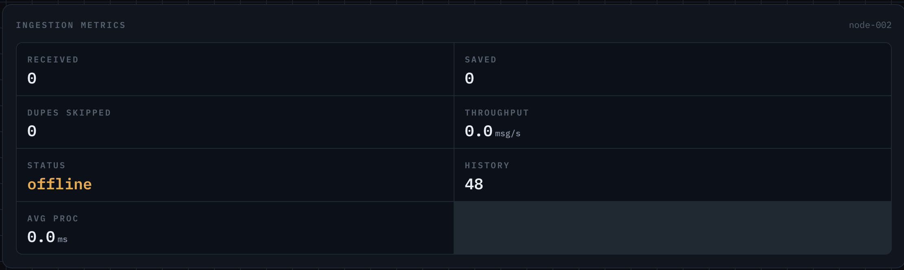
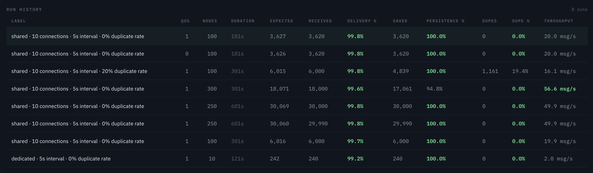
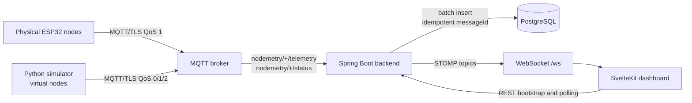

# Nodemetry

Nodemetry is an MQTT-based IoT telemetry platform for physical ESP32 sensor
nodes and virtual load-test nodes. The Spring Boot backend ingests telemetry
over MQTT/TLS, validates message identifiers, handles QoS 1 redelivery
idempotently with unique `messageId` values, persists readings in PostgreSQL,
tracks node health and run-level ingestion metrics, and broadcasts live updates
over WebSocket/STOMP to a SvelteKit dashboard.

The project is designed to demonstrate production-oriented backend ingestion,
real-time UI updates, load-test tooling, and practical bottleneck analysis for
IoT telemetry systems. In measured load tests it sustains 250 virtual nodes at
~50 msg/s with 99.8% MQTT delivery and 100% persistence; see
[Load-Test Results](#load-test-results).

## Links

- [Live demo](https://nodemetry.vercel.app)
- [Backend API docs](https://nodemetry.onrender.com/swagger-ui.html)

## Screenshots

| View                         | Screenshot                                                       |
| ---------------------------- | ---------------------------------------------------------------- |
| Live physical-node dashboard |          |
| Ingestion metrics panel      |  |
| Load-test results            |  |

## Documentation

Component-specific setup, configuration, and operational details live in the
component READMEs:

- [Backend README](backend/README.md)
- [Frontend README](frontend/README.md)
- [Simulator README](simulator/README.md)

Additional notes:

- [Run-metrics phantom duplicates](docs/run-metrics-phantom-duplicates.md)

## Architecture



## Data Flow

1. A physical ESP32 node or virtual simulator node publishes telemetry to
   `nodemetry/{nodeId}/telemetry`.
2. Nodes also publish retained status messages to `nodemetry/{nodeId}/status`;
   the simulator sets Last Will messages for unclean disconnect detection.
3. The backend MQTT subscriber receives messages from the broker and forwards
   telemetry into an in-memory batch queue.
4. The batch ingest service validates required fields and safe identifier
   formats before database work begins.
5. Unique readings are inserted into `sensor_readings`; duplicate `messageId`
   values are counted and rejected.
6. Node health is updated in `nodes`.
7. Virtual load-test runs are tracked as aggregate runs, while physical nodes are
   tracked per `(runId, nodeId)` in `physical_node_runs`.
8. Stored readings and node-status changes are broadcast over STOMP topics.
9. The dashboard bootstraps current state over REST, then keeps itself current
   through WebSocket updates and metric polling.

## Main Engineering Features

- MQTT/TLS telemetry ingestion with QoS 1 duplicate tolerance.
- Idempotent persistence using globally unique `messageId` values.
- Batched database writes with queue capacity and batch-size tuning.
- PostgreSQL-backed node, reading, virtual-run, and physical-run state.
- Per-node physical-run metrics and aggregate virtual load-test metrics.
- STOMP over WebSocket for live readings, node status, and latest-node updates.
- SvelteKit dashboard with physical-node charts and read-only production
  load-test views.
- Python simulator for load testing and duplicate-delivery checks.
- Production HTTP API read-only mode by default.

## Load-Test Results

Representative QoS 1 runs (shared mode, 10 MQTT connections, 5-second publish
interval per node), measured by backend run metrics rather than simulator-side
counters:

| Scenario           | Nodes | Duration | Delivery | Persistence | Throughput |
| ------------------ | ----- | -------- | -------- | ----------- | ---------- |
| Baseline           | 100   | 5 min    | 99.7%    | 100.0%      | 19.9 msg/s |
| 20% duplicate rate | 100   | 5 min    | 99.8%    | 100.0%      | 16.1 msg/s |
| Stable benchmark   | 250   | 10 min   | 99.8%    | 100.0%      | 49.9 msg/s |
| Saturation         | 300   | 5 min    | 99.6%    | 94.8%       | 56.6 msg/s |

Key takeaways:

- The stable range holds 250 nodes at ~50 msg/s with 100% persistence over
  10-minute runs.
- At 300 nodes, MQTT delivery stays at 99.6% while persistence drops to 94.8%:
  the bottleneck is the database write path, not broker delivery.
- The forced duplicate-delivery run rejected all 1,161 repeated `messageId`
  deliveries (19.4% of received) with zero duplicate rows persisted.
- QoS 0 and QoS 1 showed equivalent delivery at the 100-node baseline, so QoS 1
  redelivery cost is negligible at that scale.

## Tech Stack

| Layer      | Technology                                                              |
| ---------- | ----------------------------------------------------------------------- |
| Backend    | Java 21, Spring Boot 4.1, Spring MVC, Spring Data JPA, Spring WebSocket |
| Database   | PostgreSQL in production, H2 for tests                                  |
| Messaging  | MQTT/TLS, paho-mqtt for simulator, Eclipse Paho client for backend      |
| Frontend   | SvelteKit 2, Svelte 5, Vite, STOMP over WebSocket                       |
| Simulator  | Python 3, paho-mqtt 2.x                                                 |
| Build/test | Maven wrapper, npm, Python stdlib compile checks                        |

## Repository Structure

```text
nodemetry/
├── backend/       Spring Boot MQTT ingest, REST API, WebSocket, persistence
├── frontend/      SvelteKit dashboard and dev-only simulator control endpoint
├── simulator/     Python virtual MQTT node load generator
├── docs/          Supporting notes and screenshots
└── README.md      Project overview
```

## Quick Start

See the component READMEs for local setup, required environment variables, and
run commands.

## Message and Run Identifiers

`messageId` identifies a single telemetry reading. It must be unique for each
unique reading. The backend rejects repeated `messageId` values so MQTT QoS 1
redelivery and intentional duplicate tests do not create duplicate database
rows.

`runId` groups readings into a run. Physical nodes can emit a `runId` in their
telemetry and are tracked per node and per run. Virtual simulator nodes share a
load-test `runId` so the dashboard can present aggregate run results.

## QoS 1 Duplicate Handling

MQTT QoS 1 guarantees at-least-once delivery, not exactly-once persistence. A
publisher or broker may redeliver a message. Nodemetry treats duplicate
`messageId` values as repeated deliveries:

- First unique `messageId`: inserted into `sensor_readings`.
- Repeated `messageId`: counted as a duplicate and skipped.
- Metrics reconcile saved rows against duplicate events so persisted data is the
  source of truth.

## Physical Versus Virtual Nodes

Physical nodes are monitored individually. Their status, latest reading, history,
and run metrics are shown in the main dashboard.

Virtual nodes use the default `vnode-*` prefix and are primarily used for load
testing. They are hidden from the main live dashboard by default and summarized
as load-test runs.

## Testing

See the component READMEs for test and build commands.

## Deployment Overview

Production should provide PostgreSQL credentials, broker credentials, frontend
origin allowlists, and public frontend API/WebSocket URLs through a secret store
or platform environment variables.

## Limitations

- REST reads and WebSocket access are unauthenticated.
- Hibernate uses `ddl-auto=update`; managed migrations are recommended before
  long-term production use.
- The persistence path needs further tuning above the stable benchmark range.

## Future Improvements

- Add authentication or gateway protection for public REST/WebSocket access.
- Replace `ddl-auto=update` with managed migrations.
- Tune batch insert behavior, database indexes, and connection pooling for the
  300-node saturation case.
- Add automated end-to-end tests for MQTT ingest through dashboard rendering.
