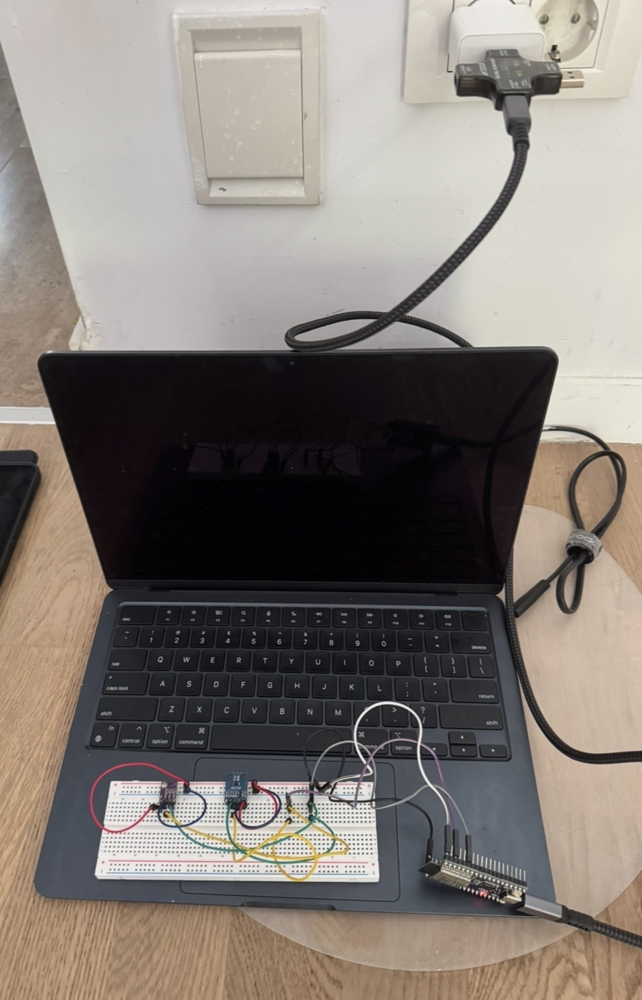

# ESP32 Sensor Node-002

## Overview

This folder contains the firmware and hardware documentation for
Nodemetry node-002.

The node measures:

- Temperature using the SHT40
- Relative humidity using the SHT40
- Light level using the BH1750
- Wi-Fi signal strength using ESP32 RSSI

The ESP32 publishes the readings to the Nodemetry MQTT broker.

## Hardware Setup

## Hardware Components
| Component | Purpose | Reason for Selection |
|---|---|---|
| ESP32 | Microcontroller and Wi-Fi connection | Integrated Wi-Fi capability, dual-core processor and low-cost hardware which enables reliable MQTT communication in embedded IoT projects|
| SHT40 | Temperature and humidity measurement | Chosen for its high measurement accuracy, digital I2C interface and factory calibration mitigating measurement uncertainty and simpler implementation |
| BH1750 | Ambient light intensity measurement measurement | Sensor directly outputs light intensity measurements in lux digitally via I2C |
| Breadboard and jumper wires | Prototype connections | Utilized to enable quick hardware modifications without soldering|
| USB-C Data cable| ESP32 power and programming connection| Supplies USB power to the development board and provides a serial connection to the host computer|

## Wiring

| Component | Sensor Pin | ESP32 Pin |
|---|---|---|
| SHT40 | VIN | 3.3V |
| SHT40 | GND | GND |
| SHT40 | SDA | GPIO 21 |
| SHT40 | SCL | GPIO 22 |
| BH1750 | VCC | 3.3V |
| BH1750 | GND | GND |
| BH1750 | SDA | GPIO 21 |
| BH1750 | SCL | GPIO 22 |

The SHT40 and BH1750 communicate using the I2C protocol, therefore they share the same SDA (GPIO 21) and SCL (GPIO 22) lines. Each sensor has a unique I2C address which enables them to operate on the same bus simultaneously.

## Firmware Behaviour

During each operating cycle, node-002:

1. Initialises the SHT40 and BH1750 sensors.
2. Connects the ESP32 to Wi-Fi.
3. Synchronises the device clock.
4. Generates a unique run ID.
5. Connects securely to the MQTT broker.
6. Reads raw temperature, humidity and light values.
7. Checks and rejects temperature and humidity outliers.
8. Applies moving-average filtering to accepted temperature and humidity readings.
9. Keeps the BH1750 light measurements unfiltered.
10. Reads Wi-Fi RSSI.
11. Generates a unique message ID.
12. Publishes the telemetry message to MQTT.

Light is kept unfiltered because lighting changes can happen
quickly when lights are switched on or off.

## MQTT Communication
Node-002 publishes telemetry to:
nodometry/node-002/telemetry

Telemetry currently contains:
- Node ID
- Run ID
- Message ID
- Raw temperature
- Filtered temperature
- Raw humidity
- Filtered humidity
- Light level
- Wi-Fi RSSI
- Firmware version

## 4. Raw and Filtered Sensor Results

### Temperature


#### Description
The SHT40 measured temperature in degrees Celsius (°C). Both the raw sensor output and the filtered value were recorded. 
#### Observation
The recorded temperature gradually decreased from about 26.29°C to 25.97°C during the measurement period. The raw data demonstrated minor fluctuations between readings following the overall trend, while the filtered data managed to produce a smoother curve that followed the temperature change. No significant outliers were identified. 

### Humidity


#### Description
Relative Humidity was measure using the SHT40 sensor and expressed as a percentage(%RH). Filtered results were processed by applying the same filtering algorithm as the temperature readings to the raw measurements. 
#### Observation
Humidity remained relatively stable between 44.3%RH and 43.8%RH. Several small spikes were noticeable in the raw measurements but the these were effectively smoothed by filtering. The filtered data demonstrated an overall downward trend, providing a more stable illustration of the humidity. 
 ### Light
 

 #### Description
 Light intensity was measured using the BH1750 as lux. Unlike temperature and humidity. No filtering was applied to more effectively capture sudden changes in illumination that represent environmental events. 

 #### Observations
 The measured light intensity varied significantly during the experiment, increasing from approximately 60 lux to a maximum of 120 lux before decreasing again. Filtering could be applied if a smoother trend were required; however, preserving rapid changes corresponding to real variations in ambient lighting was considered more important for this application.

#### Filtering Trade offs
By applying the outlier rejection and a moving average filter, stability and reliability of temperature and humidity measurements were improved. It reduced random noise from the sensor and significant spikes. However, the moving average filtering brings along a small delay as each output depends on previous samples. This can limit the capture of genuine environmental changes. 

The light sensor was intentionally unfiltered to preserve real-time changes in illumination such as lights being switched on or off. On the other hand, raw measurements are more vulnerable to short-term fluctuations and may result in noisier data. 

## RSSI (Wi-fi Signal Strength Experiment)

This experiment evaluates the wireless communication performance of the ESP32 sensor node by measuring the RSSI at different locations.

The ESP32 node was placed at four different locations within the same floor while connected to the same Wi-Fi. At each location, the node was held stationary and the RSSI value was recorded. 

### Results
| Location | RSSI (dBm) | Signal Quality |
|---|---|---|
| Beside Wi-Fi router | -23 dBm | Excellent |
| Same room | -39 dBm | Excellent |
| Adjacent room | -70 dBm | Good | 
| Furthest room | -76 dBm | Fair |

The measured RSSI decreased as the distance from the Wi-Fi router increased and additional walls separated the ESP32 and the router. RSSI dropped from -23 dBm beside the router to - 76 dBm in the furthest room, demonstrating a logical attenuation of Wi-Fi signals in an indoor environment. 


Despite the fall in RSSI, the ESP32 maintained a stable Wi-Fi and MQTT connection at all test locations, implying that the node can reliably transmit data under typical indoor conditions.


## MQTT QoS 0 vs 1 Reliability Test

MQTT Quality of Service (QoS) refers to how reliably a message is delivered between the publisher and broker.

- QoS 0 - Provides at-most-once delivery. Message is sent once without requiring an acknowledgement from the broker. It has the lowest communication overhead and but messages may be lost in the event of a network connection interruption. 

- QoS 1 - Provides at-least-once delivery. The publisher receives an acknowledgement from the broker that the message has been received. If not received, the message can be retransmitted. This improves reliability of delivery but brings additional network overhead along with potential duplicate messages. 

To compare QoS 0 and QoS 1, we need to evaluate their effects on message delivery, persistence, duplicates and throughput.

### Test confiugration
| Parameter | Value |
|---|---| 
| Virtual nodes | 100 |
| Publishing interval | 5s |
| Test duration | Apprximately 122s |
| Expected throughput | ~20 msg/s |
| MQTT QoS | QoS 0 and QoS 1|

### Results
| Metric | QoS 0 | QoS 1 |
|---|---|---|
| Expected messages | 2436 | 2435 |
| Received messages | 2404 | 2398 | 
| Delivery rate | 98.7% | 98.5% |
| Saved messages | 2404 | 2398 |
| Persistence | 100.0% | 100.0% |
| Duplicate messages | 0 | 0 |
| Throughput | 19.7 msg/s | 19.7 msg/s |

Both QoS levels performed at a similar level during the test. QoS 0 achieved 98.7% delivery rate while QoS 1 achieved 98.5%, a difference of 0.2 percentage points. Additionally, both tests maintained a throughput of 19.7 msg/s with 100% persistence with no duplicates recorded. Persistence refers to the percentage of received MQTT messages successfully stored by the backend

Although QoS 1 theoretically provides greater delivery assurance through acknowledgements and retransmission, this advantage was not clearly indicated in this experiment. Under the stable network conditions used in this experiment, QoS 0 and QoS 1 produced similar observed delivery rates and throughput. The theoretical reliability advantage of QoS 1 was therefore not evident within this short test.


## Power Consumption and Deep Sleep

The purpose of the experiment was to compare the system-level energy consumption of the sensor node under:

1. Always-on operation
2. 60-second deep-sleep operation

Both configurations were tested for approximately 60 minutes.

### Deep Sleep Implementation

A separate version of the ESP32 firmware was developed to implement low-power operation using the ESP32 deep-sleep mode.

In the original always-on firmware which I implemented above, the ESP32 remains powered and connected to Wi-Fi and MQTT between sensor readings. In the deep-sleep firmware, the node instead executes this cycle:

1. Wake ESP32
2. Initialise sensors
3. Connect to Wi-Fi
4. Connect to MQTT
5. Read sensors
6. Apply outlier rejection
7. Apply moving-average filter
8. Publish telemetry
9. Enter deep sleep for 60 seconds
10. Timer wakes ESP32
11. Repeat

The wake-up timer is configured using:

```cpp
#define Second_Factor 1000000ULL
#define TIME_TO_SLEEP 60

esp_sleep_enable_timer_wakeup(
  TIME_TO_SLEEP * Second_Factor
);
```

The device then enters deep sleep using:

```cpp
esp_deep_sleep_start();
```

Once this function is called, normal operation stops until the ESP32 is woken up by the timer. When the ESP32 wakes up again, the firmware starts again from `setup()`.

#### RTC Memory

One challenge introduced by deep sleep is that normal RAM is not preserved between sleep cycles.

The original firmware uses previous measurements for:

- Moving-average filtering
- Outlier rejection
- Run identification

If these variables were stored only in normal RAM, they would reset every time the ESP32 entered deep sleep.

To solve this problem, important variables were stored in RTC memory using:

```cpp
RTC_DATA_ATTR
```

The following values were preserved:

```cpp
RTC_DATA_ATTR char storedRunId[32] = "";

RTC_DATA_ATTR bool hasStoredRunId = false;

RTC_DATA_ATTR unsigned long sequenceNumber = 0;

RTC_DATA_ATTR float temperatureReadings[FILTER_SIZE] = {0};

RTC_DATA_ATTR float humidityReadings[FILTER_SIZE] = {0};

RTC_DATA_ATTR int filterIndex = 0;

RTC_DATA_ATTR int validReadingCount = 0;

RTC_DATA_ATTR float previousTemperature = 0.0;

RTC_DATA_ATTR float previousHumidity = 0.0;

RTC_DATA_ATTR bool hasPreviousReading = false;
```

This allows the sensor node to maintain its filtering system between wakes.

#### Run ID Persistence

The original firmware creates a run ID using the current UTC time. However, because waking up from deep sleep causes `setup()` to run again, generating a new run ID after every wake would cause each reading to appear as a separate run. Therefore, the solution was to store a copy of the run ID in RTC memory.

A new run ID is initially created:

```cpp
if (!hasStoredRunId) {
  runId = createRunId();

  runId.toCharArray(
    storedRunId,
    sizeof(storedRunId)
  );

  hasStoredRunId = true;
}
```

After waking up from deep sleep, the previously stored run ID is restored:

```cpp
else {
  runId = String(storedRunId);
}
```

### Test Setup



- Wall socket
- USB-C charger
- USB power meter
- USB-C cable
- ESP32 sensor node

The same ESP32, sensors, Wi-Fi network and physical location were used for both tests.

The USB power meter recorded:

- Voltage
- Current
- Accumulated charge in mAh
- Accumulated energy in Wh

The meter was reset before each experiment.

The deep-sleep publish interval is slightly longer than 60 seconds because additional time is required to initialise the sensors, reconnect to Wi-Fi and MQTT, take the measurement and publish the message.

### Results

| Mode | Duration | Energy Consumption | Charge Consumption |
|---|---|---|---|
| Always-on | 60 min | 0.26 Wh | 51 mAh |
| Deep sleep (60 s) | 60 min | 0.03 Wh | 5 mAh |

The 60-second deep-sleep configuration reduced measured energy consumption by approximately 88.5% compared with always-on operation and reduced charge consumption by 90.2%.

### Estimated Battery Life

Using the measured average charge consumption:

- Always-on: approximately 51 mA average
- Deep sleep: approximately 5 mA average

Battery life can be estimated using:

```text
Battery life (hours) = Battery capacity (mAh) / Average current (mA)
```

For a theoretical 2000 mAh battery:

- Always-on: 2000 / 51 ≈ 39.2 hours ≈ 1.6 days
- Deep sleep: 2000 / 5 ≈ 400 hours ≈ 16.7 days

These values are theoretical estimates rather than guaranteed battery runtimes.

### Engineering Trade-Off

Advantages:

- Significantly lower power consumption
- Longer theoretical battery runtime
- Suitable for battery-powered environmental monitoring
- RTC memory allows filtering and message information to survive between wakes

Disadvantages:

- The node is unavailable while sleeping
- Wi-Fi and MQTT must reconnect after every wake
- Additional energy is consumed during network connection
- Sensor updates are less frequent and therefore reduce responsiveness

For environmental monitoring, measurements generally change relatively slowly, so periodic readings using deep sleep can provide a good balance between monitoring frequency and energy consumption.

### Limitations

The experiment used a USB power meter rather than laboratory-grade power measurement equipment. During deep sleep, the current consumption became low enough that the USB meter's internal elapsed-time counter stopped increasing consistently. Therefore, the deep-sleep experiment duration was measured using an external timer.

The power meter may also have been unable to accurately resolve the very low current consumed during deep sleep. Hence, the measured values should be interpreted as approximate energy consumption rather than precise measurements of the current.

The estimated battery runtimes also do not account for:

- Battery conversion efficiency
- Voltage regulator losses
- Battery self-discharge
- Battery capacity variation
- Wi-Fi signal strength
- Network connection time

## Overall Results
The ESP32 sensor node successfully collected temperature, humidity and ambient light measurements using the SHT40 and BH1750 sensors and transmitted the data to the Nodometry backend using MQTT.

Temperature and humidity measurements were processed through outlier rejection and a five-sample moving average filter. The filtered values indicated reduced short-term variation while following the overall trend. Light measurements were intentionally left unfiltered to preserve rapid changes in illumination.

Physical RSSI testing showed that Wi-Fi strength decreased significantly as the node was moved further from the router. Despite this, the node was able to maintain wireless communication throughout the experiment. 

MQTT reliability testing was also performed using 100 simulated nodes. Both QoS 0 and 1 had delivery rates above 98%, approximately 19.7 messages/s throughput, 100% persistence of received messages with no duplicates. 

Overall, the results demonstrate successful integration of environmental sensing, embedded data processing and wireless MQTT telemetry within an ESP32-based sensor node.

## Limitations
- The environmental measurements were not compared against a calibrated reference instrument so the absolute measurement accuracy of the sensor node has not been independently verified

- Temperature and humidity filtering parameters were chosen for the current application and may not provide the optimum response for every environment

- RSSI testing was conducted at a limited number of indoor locations rather than a controlled distance-based experiment. This means that the test was unable to separate the individual effects of distance, walls and other obstacles. 

- QoS experiment was performed under stable network conditions and for a limited test duration. Therefore, unstable network conditions may produce different results.

- Only temperature, humidity and light are measured by the node, limiting other environmental parameters that can be monitored

- Current node uses a breadboard and jumper wires for development purposes rather than permanent usage. 

## Future Improvements
- Perform longer MQTT reliability experiments under unstable network conditions to investigate the advantages of QoS 1. 

- Repeat RSSI testing across more locations and record distance and number of physical obstacles for improved analysis

- Compare sensor measurements against a reference instrument and calibrate accordingly 

- Investigate alternative filtering techniques such as median or exponential moving average filters. 

- Replace the breadboard prototype with a more permanent PCB and casing for practical usage


