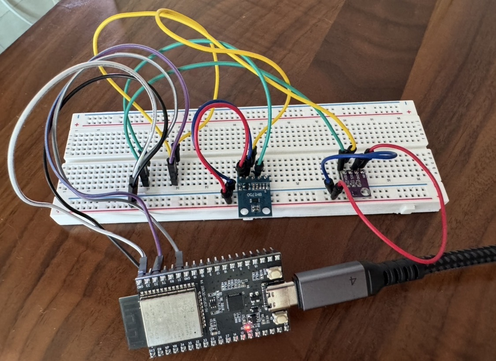
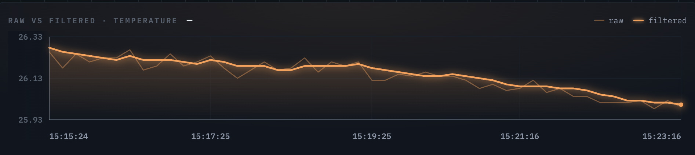
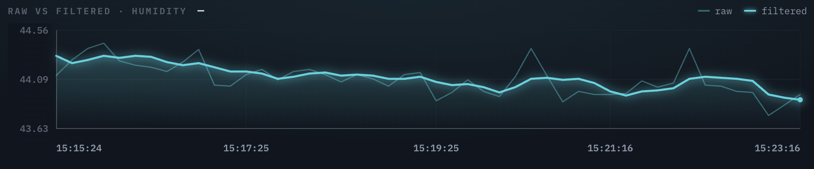
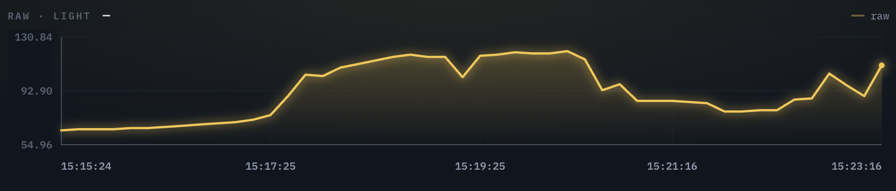
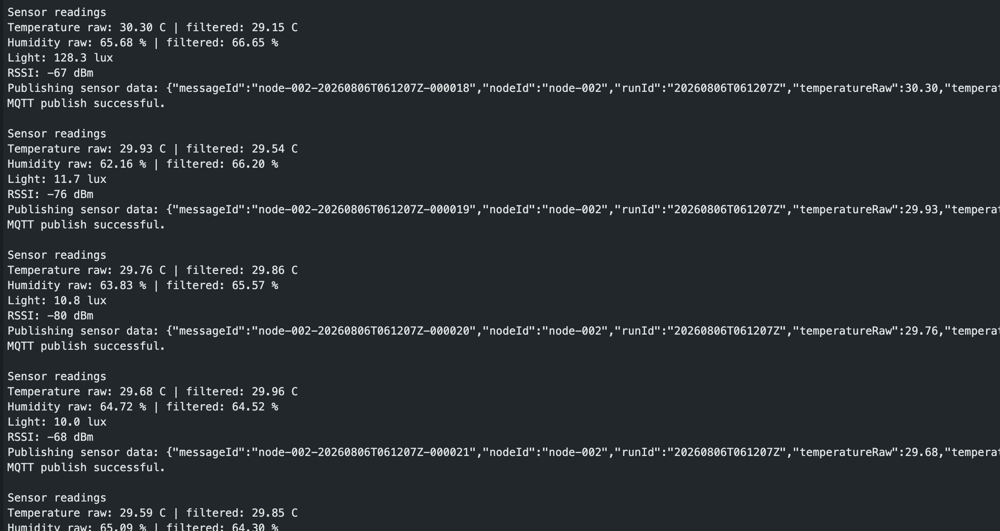

# ESP32 Sensor Node-002

## Overview

This folder contains the firmware and hardware documentation for
Nodemetry sensor node `node-002`.

The node measures:

- Temperature using the SHT40
- Relative humidity using the SHT40
- Light level using the BH1750
- Wi-Fi signal strength using ESP32 RSSI

The ESP32 publishes the readings to the Nodemetry MQTT broker.

## Hardware Setup

## Hardware Components
| Component | Purpose | Interface |
|---|---|---|
| ESP32 | Microcontroller and Wi-Fi connection | Integrated Wi-Fi capability, dual-core processor and low-cost hardware which enables reliable MQTT communication in embedded IoT projects |
| SHT40 | Temperature and humidity measurement | Chosen for its high measurement accuracy, digital I2C interface and factory calibration mitigating measurement uncertainty and simpler implementation |
| BH1750 | Ambient light intensity measurment measurement | Sensor directly outputs light intensity measurments in lux digitally via I2C |
| Breadboard and jumper wires | Prototype connections | Utilized to enable quick hardware modifications without soldering|
| USB-C Data cable| ESP32 power supply| Provides a regulated power source for the ESP32 and the sensors|

## Wiring

| Component | Sensor Pin | ESP32 Pin |
|---|---|---|
| SHT40 | VIN | 3.3V |
| SHT40 | GND | GND |
| SHT40 | SDA | GPIO 21 |
| SHT40 | SCL | GPIO 22 |
| BH1750 | VCC | 3.3V |
| BH1750 | GND | GND |
| BH1750 | SDA | GPIO 21 |
| BH1750 | SCL | GPIO 22 |

The SHT40 and BH1750 communicate using the I2C protocol, therefore they share the same SDA (GPIO 21) and SCL (GPIO 22) lines. Each sensor has a unqiue I2C address which enables them to operate on the same bus simultaneously.

## Firmware Behaviour

During each operating cycle, node-002:
1. Initialises the SHT40 and BH1750 sensors.
2. Connect the ESP32 to Wi-Fi.
3. Synchronise the device clock.
4. Generates a unique run ID
5. Connect securely to the MQTT broker.
6. Read raw temperature, humidity and light values.
7. Checks and rejects temperature and humidity outliers.
8. Applies moving-average filtering to accepted temperature and humidity readings
9. Keeps the BH1750 light measurements unfiltered
8. Read Wi-Fi RSSI.
9. Generates a unique message ID
10. Publish telemetry message to MQTT.

Light is kept unfiltered because lighting changes can happen
quickly when lights are switched on or off.

## MQTT Communication
Node-002 publishes telemtry to:
nodometry/node-002/telemtry

Telemetry currently contains:
- Node ID
- Run ID
- Message ID
- Raw temperature
- Filtered temperature
- Raw humidity
- Filtered humidity
- Light level
- Wi-Fi RSSI
- Firmware version

## 4. Raw and Filtered Sensor Results

### Temperature

#### Description
The SHT40 measured temperature in degrees Celcius (°C). Both the raw sensor output and the filtered value were recorded. 
#### Observation
The recorded temperature gradually decreased from about 26.29°C to 25.97°C during the measurement period. The raw data demonstrated minor fluctuations between readings following the overall trend, while the filtered data managed to produce a smoother curve that followed the temperature change. No significant outliers were identified, indicating a successful filtering process and sensor performance.
### Humidity

#### Description
Relative Humidity was measure using the SHT40 sensor and expresssed as a percentage(%RH). Filtered results were processed by applying the same filtering algorithm as the temperature readings to the raw measurements. 
#### Observation
Humidity remianed relatively stable between 44.3%RH and 43.8%RH. Several small spikes were noticeable in the raw measurments but the these were effectively smoothed by filtering. The filtered data demonstrated an overall downward trend, providing a more stable illustration of the humidity. 
 ### Light
 

 #### Description
 Light intensity was measured using the BH1750 as lux. Unlike temperature and humidity. No filtering was applied to more effectively capture sudden changes in illumination that represent environmental events. 

 #### Observations
 The measured light intensity varied significantly during the experiment, increasing from approximately 60 lux to a maximum of 120 lux before decreasing again. Light measurement fitlering could be applied if in need of a smoother trend but capturing the rapid changes that stay consistent with the fluctuating ambient lighting conditions seem to be more crucial. 

#### Filtering Trade offs
By applying the outlier rejection and a moving average filter, stability and reliability of temperature and humidity measurements were improved. It reduced random noise from the sensor and significant spikes. However, the moving average filtering brings along a small delay as each output depends on previous samples. This can limit the capture of genuine environmental changes. 

The light sensor was intentionally unfiltered to preserve real-time changes in illumination such as lights being switched on or off. On the other hand, raw measurments are more vulnerable to short-term fluctuations and may result in noisier data. 

## RSSI (Wi-fi Signal Strength Experiment)

This experiment evaluates the wirless communication performance of the ESP32 sensor node by measuring the RSSI at different locations.

The ESP32 node was placed at four different lcoations within the same floor while connected to the same Wi-Fi. At each location, the node was held stationary and the RSSI value was recorded. 

### Results
| Location | RSSI (dDm) | Signal Quality |
|---|---|---|
| Beside Wi-Fi router | -23 dBm | Excellent |
| Same room | -39 dBm | Excellent |
| Adjacent room | -70 dBm | Good | 
| Furthest room | -76 dBm | Fair |

The measured RSSI decreased as the distance from the Wi-Fi router increased and additional walls separated the ESP32 and the router. RSSI dropped from -23 dBm beside the router to - 76 dB in the furthest room, demonstrating a logical attenuation of Wi-Fi singals in an indoor environment. 

Despite the fall in RSSI, the ESP32 maintained a stable Wi-Fi and MQTT connection at all test locations, implying that the node can reliably transmit data under typical indoor conditions.

## MQTT QoS 0 vs 1 Reliability Test

MQTT Quality of Service (QoS) refers to how reliably a message is delivered between the publisher and broker.

- QoS 0 - Provides at-most-once delivery. Message is sent once without requiring an acknowledgement from the broker. It has the lowest communication overhead and but messages may be lost in the event of a network connection interruption. 

- QoS 1 - Provides at-least-once delivery. The publsiher receives an acknowledgement from the broker that the message has been received. If not received, the message can be retransmitted. This improves reliability of delivery but brings additional network overhead along with potential duplicate messages. 

To compare QoS 0 and Qos 1, we need to evaluate their effects on message delivery, persistence, duplicates and throughput.

### Test confiugration
| Paramater | Value |
|---|---| 
| Virtual nodes | 100 |
| Publishing interval | 5s |
| Test duration | Apprximately 122s |
| Expected throughput | ~20 msg/s |
| MQTT QoS | QoS 0 and QoS 1|

### Results
| Metric | QoS 0 | QoS 1 |
|---|---|---|
| Expected messages | 2436 | 2435 |
| Received messages | 2404 | 2398 | 
| Delivery rate | 98.7% | 98.5% |
| Saved messages | 2404 | 2398 |
| Persistance | 100.0% | 100.0% |
| Duplicate messages | 0 | 0 |
| Throughput | 19.7 msg/s | 19.7 msg/s |

Both QoS levels performed at a similar level during the test. QoS 0 achieved 98.7% delivery rate while QoS 1 achieved 98.5%, a difference of 0.2 percentage points. Additionally, both tests maintained a throughput of 19.7 msg/s with 100% persistance with no duplicates recorded.

Although QoS 1 theoretically provides greater delivery assurance through acknowledgements and retransmission, this advantage was not clearly indicated in this experiment. The results therefore present that QoS 0 provided similar reliability with lower protocol overhead under these test conditions, while QoS 1 offers additional delivery assurance that may become more significant under unreliable network conditions. 

## Overall Results
The ESP32 sensor node successfully collected temperature, humidity and ambient light measurements using the SHT40 and BH1750 sensors and transmitted the data to the Nodometry backend using MQTT.

Temperature and humidity measurements were processed through outlier rejection and a five-sample moving average filter. The filtered values indicated reduced short-term variation while following the overall trend. Light measurements were intentionally left unfiltered to preserve rapid changes in illumination.

Physical RSSI testing showed that Wi-Fi strength decreased significantly as the node was moved further from the router. Despite this, the node was able to maintain wireless communication throughout the experiment. 

MQTT reliability testing was also performed using 100 simulated nodes. Both QoS 0 and 1 had delivery rates above 98%, approximately 19.7 messages/s throughput, 100% persistenve of received messages with no duplicates. 

Overall, the results demonstrate successfull integration of environemntal sensing, embedded data processing and wireless MQTT telemetry within a ESP32-based sensor node.

## Limitations
- The environmental measurements were not compared against a calibratedd reference instrument so the absolute measurement accuracy of the sensor node has been specifically verified

- Temperature and humidity filtering paramters were chosen for the current application and may not provide the optimum response for every environemnt

- RSSI testing was conducted at a limited number of indoor locations rather than a controlled distance-based experiment. This means that the test was unable to seperate the individual effects of distance, walls and other obstacles. 

- QoS experiment was performed under stable network conditions and for a limited test duration. Therefore, unstable network conditions may produce different results.

- Only temperature, humidity and light are measured by the node, limiting other environmental parameters that can be monitored

- Current node uses a breadboard and jumper wires for development purposes rather than permanent usage. 

## Future Improvements
- Perform longer MQTT reliability experiments under unstable network conditions to investigate the advantages of QoS 1. 

- Repeat RSSI testing across more locations and record distance and number of physical obstacles for improved analysis

- Compare sensor measurements against a reference instrument and calibrate accordingly 

- Investigate alternative filtering techniques such as median or exponential moving average filters. 

- Replace the breadboard protoype with a more permanent PCB and casing for practical usage

